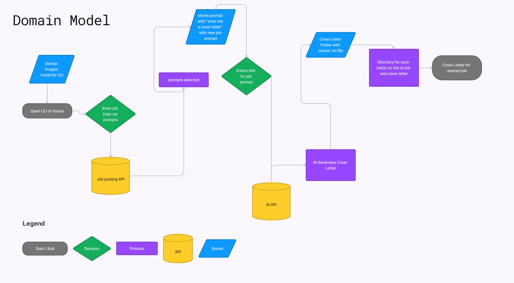

# Cover_Me

### Authors

Sarah Glass, Anthony Sinitsa, Dan Quinn, Logan Reese for seattle_c_py_401d22

## Description

We will create a CLI app that will build a web scraper from job search sites online like monster.com, indeed.com, etc. We will collect data for job listings in the tech industry such as company name, skills, education level, salary detail, etc. and then allow users to search for jobs by keyword, save jobs they are interested in, and run the job's data through AI to produce a sample cover letter for that job.

Helps users find relevant and recent job listings in the tech industry, select listings they like, and then prompt AI to process the listing's data to produce a sample cover letter for the given job posting.

## CLI wireframe

__1. User launches the CLI app__

- The user opens their terminal or command prompt.
- They navigate to the directory where the CLI app is located.
- They execute a command to launch the app.
.jpg>)

__2. Main menu__

- The CLI app displays a main menu with several options.
- The user can select an option by entering a corresponding number or command.
```
Welcome to the Cover Me job scraper!

What would you like to do?

* Scrape job listings
* Search for jobs (keyword)
* Save jobs
* Generate cover letter
* Exit
```

__3. Scraping job listings__

If the user selects the "Scrape job listings" option:
- The app prompts the user to select a job search site (e.g., monster.com,   indeed.com).
- The app initiates the scraping process, collecting data for job listings in    the tech industry.
- As the app scrapes data, it provides a progress update in the terminal.
```
Please select a job search site:

* Monster.com
* Indeed.com
* Other
```
__4. Search for jobs__

If the user selects the "Search for jobs" option:
- The app prompts the user to enter a keyword or search term.
```
Please enter a keyword or search term:
```
- The app searches the scraped job data for listings that match the keyword.
- It displays the matching job listings, including company name, skills, education level, and salary details.
```
--------------------------------------
Job Title | Company Name | Skills | Education Level | Salary
------- | -------- | -------- | -------- | --------
Software Engineer | Google | Python, Java, C++ | Bachelor's degree | $100,000
Data Scientist | Facebook | SQL, R, Machine Learning | Master's degree | $120,000
UX Designer | Apple | Figma, Sketch, Adobe XD | Bachelor's degree | $90,000
```

__5. Save jobs__

If the user finds a job listing they are interested in:
- They can select the "Save job" option.
- The app prompts them to provide a name or identifier for the saved job.
```
Please enter a name or identifier for the saved job:
```
- The app saves the selected job listing with the provided name.

__6. Generate cover letter__

If the user selects the "Generate cover letter" option:
- The app prompts the user to select a saved job listing.
- Once a job is selected, the app runs its data through an AI model to generate a sample cover letter.
- The generated cover letter is displayed in the terminal.

```
=====================================
      COVER LETTER FOR Job X
=====================================

[Your Name]
[Your Address]
[City, State, ZIP Code]
[Email Address]
[Phone Number]
[Date]

[Recipient's Name]
[Recipient's Job Title]
[Company Name]
[Company Address]
[City, State, ZIP Code]

Dear [Recipient's Name],

I am writing to express my strong interest in the [Job Title] position at [Company Name], as advertised on [Job Listing Source]. 
With my solid background in the tech industry and a passion for [Specific Area of Tech], I believe I would be an excellent fit for your organization.

I have [X years] of experience working as a [Current or Most Recent Job Title] at [Current or Most Recent Company]. 
During my time there, I have successfully [Highlight Key Achievements or Responsibilities]. 
These experiences have equipped me with a deep understanding of [Relevant Technologies or Tools] and honed my ability to [Describe Relevant Skills or Expertise].

In addition to my technical skills, I am a highly motivated individual with a strong problem-solving mindset. I thrive in fast-paced environments and enjoy collaborating with cross-functional teams to deliver innovative solutions. 
I am confident in my ability to contribute to [Company Name]'s mission of [Company Mission or Values] and help drive its success in the tech industry.

I was particularly excited to learn about [Specific Achievement or Project] at [Company Name]. The opportunity to be part of such groundbreaking initiatives aligns perfectly with my career aspirations. 
I am eager to leverage my skills and knowledge to contribute to the continued growth and innovation of [Company Name].

Please find attached my resume for your review.
 I would welcome the opportunity to discuss how my skills and experience align with the [Job Title] position and learn more about [Company Name]'s vision for the future. Thank you for considering my application.

I look forward to the possibility of joining [Company Name] and contributing to its ongoing success. Thank you for your time and consideration.

Sincerely,

[Your Name]

=====================================
```

__7. Exit the app__

If the user selects the "Exit" option:
- The app terminates and the terminal session returns to the command prompt.


## User Stories
1. Job seeker: I want to search for job listings in tech industry by entering keywords, so that I can find relevant opportunities
2. User: I want to filter job listings by location and date posted, so that I can view recent and localized job opportunities
3. User 2: I want to generate a sample cover letter for a selected job listing using AI processing to help me kickstart my application process
4. Job seeker: I want to view detailed information about a job listing, including company name, required skills, education level, and salary details, so that I can assess if it aligns with my qualifications and expectations.
5. Accessibility: as a job seeker, I want to be able to access the job info and cover letter samples for free, and with an acceptable accessibility score (whatever the CLI version of Lighthouse is).

## Domain Model



### [Software Requirements](https://github.com/Cover-Me401/Team-Agreement/blob/main/requirements.md)

## Links and Resources

- [Job Scraping Github that spawned the idea/dream](https://github.com/Ashishkapil/Web-scraping-job-portal-sites)

- [How to Scrape Indeed in 2023](https://scrapeops.io/web-scraping-playbook/how-to-scrape-indeed/)

- [Automating Job Search with Python using BeautifulSoup and Selenium](https://www.chrislovejoy.me/job-scraper)

- [BeautifulSoup documentation](https://www.crummy.com/software/BeautifulSoup/bs4/doc/)

- [Scrape Ops Proxy Aggregator for anti-bot protection](https://scrapeops.io/proxy-aggregator/)

- [Scrape LinkedIn Using Selenium And Beautiful Soup in Python](https://www.geeksforgeeks.org/scrape-linkedin-using-selenium-and-beautiful-soup-in-python/)


## Setup

- ENV requirements:

## How to initialize/run application

- python3 -m docker.modules.program_start
- python3 -m docker.modules.program_start

## Libraries & Tools

- os, shutil, sys, rich
- Bard Chatbot
- BeautifulSoup
- dotenv
- fitz
- [ScrapeOps API Key](https://scrapeops.io/proxy-aggregator/)
- JSON
- requests
- URLLIB urlencode
- re


## Tests

for example:

- pytest tests/test_test.py
- Testing using pytest's `monkeypatch` and `capsys` features


```python
import requests
from bs4 import BeautifulSoup

def get_job_postings(keyword):
  url = "https://www.indeed.com/jobs?q={}&l=".format(keyword)
  response = requests.get(url)
  soup = BeautifulSoup(response.content, "html.parser")
  job_postings = []
  for job_card in soup.find_all("div", class_="jobsearch-JobCard"):
    job_title = job_card.find("a", class_="jobtitle").text
    company_name = job_card.find("span", class_="company").text
    location = job_card.find("span", class_="location").text
    job_postings.append({
      "job_title": job_title,
      "company_name": company_name,
      "location": location,
    })
  return job_postings

job_postings = get_job_postings("software engineer")
for job_posting in job_postings:
  print(job_posting)
  ```