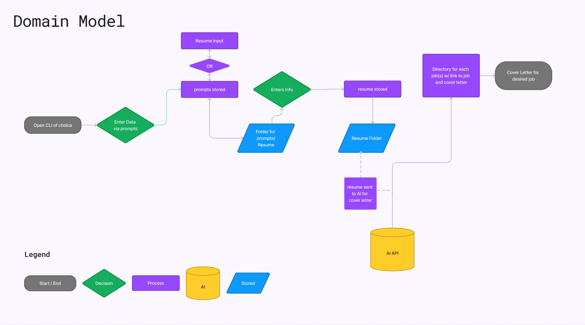

# Cover_Me
### Authors
Sarah Glass, Anthony Sinitsa, Dan Quinn, Logan Reese

## Description

We will create a CLI app that will build a web scraper from job search sites online like monster.com, indeed.com, etc. We will collect data for job listings in the tech industry such as company name, skills, education level, salary detail, etc. and then allow users to search for jobs by keyword, save jobs they are interested in, and run the job's data through AI to produce a sample cover letter for that job.

Helps users find relevant and recent job listings in the tech industry, select listings they like, and then prompt AI to process the listing's data to produce a sample cover letter for the given job posting.

## CLI wireframe
```
=====================================
      COVER LETTER ASSISTANT
=====================================

Please provide the following information:

1. Job Title: ______________________
2. Company Name: ___________________
3. Your Name: ______________________
4. Your Address: ____________________
5. City: ___________________________
6. State: __________________________
7. Postal Code: ____________________
8. Email Address: ___________________
9. Phone Number: ___________________

10. Desired Skills (comma-separated): _______________________

11. Previous Experience: 
   - Job Title: __________________________
     Company: ___________________________
     Duration: __________________________
     Description: ________________________

   - Job Title: __________________________
     Company: ___________________________
     Duration: __________________________
     Description: ________________________

12. Education: 
   - Degree: ____________________________
     University: _________________________
     Year: _____________________________

   - Degree: ____________________________
     University: _________________________
     Year: _____________________________

=====================================
```

### [User Stories](https://github.com/orgs/Cover-Me401/projects/1)

## Domain Model



## References

- [Job Scraping Github that spawned the idea/dream](https://github.com/Ashishkapil/Web-scraping-job-portal-sites)